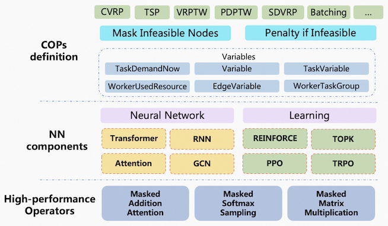

# 🤠GreedRL


## Overview

- 🤠GreedRL is a Deep Reinforcement Learning (DRL) based solver that can solve various types of problems, such as TSP, VRPs (CVRP, VRPTW, VRPPD, etc), Order Batching Problem, Knapsack Problem, etc.

- 🤠GreedRL achieves very high performance by running on GPU while generating high quality solutions.
  **1200 times faster** than [Google OR-Tools](https://developers.google.com/optimization) for large-scale (>=1000 nodes) CVRP, and the solution quality is improved by **about 3%**.

## 🏆Award

- Entering the finalists of [INFORMS 2021 Franz Edelman Award](https://www.informs.org/Resource-Center/Video-Library/Edelman-Competition-Videos/2021-Edelman-Competition-Videos/2021-Edelman-Finalist-Alibaba)
- Obtain [The Second Class Prize of Scientific and Technological Progress Award](https://www.ccf.org.cn/Awards/Awards/2022-11-08/776110.shtml).

## Editions

We have delivered the following two editions of 🤠GreedRL for users.

- **The Community Edition** is open source and available to [download](https://huggingface.co/Cainiao-AI/GreedRL).
- **The Enterprise Edition** has a higher performance implementation than **The Community Edition** (about 50 times faster), especially when solving larg-scale problems. For more informations, please contact <a href="mailto:jiangwen.wjw@alibaba-inc.com">us</a>.


## Architecture


## COPs Modeling examples

### Standard problems

#### Capacitated Vehicle Routing Problem (CVRP)
<details>
    <summary>CVRP</summary>

```python
from greedrl.feature import *
from greedrl.variable import *
from greedrl.function import *
from greedrl import Problem, Solution, Solver
from greedrl import runner

features = [continuous_feature('task_demand'),
            continuous_feature('worker_weight_limit'),
            continuous_feature('distance_matrix'),
            variable_feature('distance_this_to_task'),
            variable_feature('distance_task_to_end')]

variables = [task_demand_now('task_demand_now', feature='task_demand'),
             task_demand_now('task_demand_this', feature='task_demand', only_this=True),
             feature_variable('task_weight'),
             worker_variable('worker_weight_limit'),
             worker_used_resource('worker_used_weight', task_require='task_weight'),
             edge_variable('distance_last_to_this', feature='distance_matrix', last_to_this=True),
             edge_variable('distance_this_to_task', feature='distance_matrix', this_to_task=True),
             edge_variable('distance_task_to_end', feature='distance_matrix', task_to_end=True)]


class Constraint:

    def do_task(self):
        return self.task_demand_this

    def mask_task(self):
        # 已经完成的任务
        mask = self.task_demand_now <= 0
        # 车辆容量限制
        worker_weight_limit = self.worker_weight_limit - self.worker_used_weight
        mask |= self.task_demand_now * self.task_weight > worker_weight_limit[:, None]
        return mask

    def finished(self):
        return torch.all(self.task_demand_now <= 0, 1)


class Objective:

    def step_worker_end(self):
        return self.distance_last_to_this

    def step_task(self):
        return self.distance_last_to_this
```

</details>

#### Pickup and Delivery Problem with Time Windows (PDPTW)
<details>
    <summary>PDPTW</summary>

```python
from greedrl.model import runner
from greedrl.feature import *
from greedrl.variable import *
from greedrl.function import *
from greedrl import Problem, Solution, Solver

features = [local_category('task_group'),
            global_category('task_priority', 2),
            variable_feature('distance_this_to_task'),
            variable_feature('distance_task_to_end')]

variables = [task_demand_now('task_demand_now', feature='task_demand'),
             task_demand_now('task_demand_this', feature='task_demand', only_this=True),
             feature_variable('task_weight'),
             feature_variable('task_group'),
             feature_variable('task_priority'),
             feature_variable('task_due_time2', feature='task_due_time'),
             task_variable('task_due_time'),
             task_variable('task_service_time'),
             task_variable('task_due_time_penalty'),
             worker_variable('worker_basic_cost'),
             worker_variable('worker_distance_cost'),
             worker_variable('worker_due_time'),
             worker_variable('worker_weight_limit'),
             worker_used_resource('worker_used_weight', task_require='task_weight'),
             worker_used_resource('worker_used_time', 'distance_matrix', 'task_service_time', 'task_ready_time',
                                  'worker_ready_time'),
             edge_variable('distance_last_to_this', feature='distance_matrix', last_to_this=True),
             edge_variable('distance_this_to_task', feature='distance_matrix', this_to_task=True),
             edge_variable('distance_task_to_end', feature='distance_matrix', task_to_end=True)]


class Constraint:

    def do_task(self):
        return self.task_demand_this

    def mask_worker_end(self):
        return task_group_split(self.task_group, self.task_demand_now <= 0)

    def mask_task(self):
        mask = self.task_demand_now <= 0
        mask |= task_group_priority(self.task_group, self.task_priority, mask)

        worker_used_time = self.worker_used_time[:, None] + self.distance_this_to_task
        mask |= (worker_used_time > self.task_due_time2) & (self.task_priority == 0)

        # 容量约束
        worker_weight_limit = self.worker_weight_limit - self.worker_used_weight
        mask |= self.task_demand_now * self.task_weight > worker_weight_limit[:, None]
        return mask

    def finished(self):
        return torch.all(self.task_demand_now <= 0, 1)


class Objective:

    def step_worker_start(self):
        return self.worker_basic_cost

    def step_worker_end(self):
        feasible = self.worker_used_time <= self.worker_due_time
        return self.distance_last_to_this * self.worker_distance_cost, feasible

    def step_task(self):
        worker_used_time = self.worker_used_time - self.task_service_time
        feasible = worker_used_time <= self.task_due_time
        feasible &= worker_used_time <= self.worker_due_time
        cost = self.distance_last_to_this * self.worker_distance_cost
        return torch.where(feasible, cost, cost + self.task_due_time_penalty), feasible
```

</details>


#### VRP with Time Windows (VRPTW)
<details>
    <summary>VRPTW</summary>

```python
from greedrl import Problem, Solution, Solver
from greedrl.feature import *
from greedrl.variable import *
from greedrl.function import *
from greedrl.model import runner
from greedrl.myenv import VrptwEnv

features = [continuous_feature('worker_weight_limit'),
            continuous_feature('worker_ready_time'),
            continuous_feature('worker_due_time'),
            continuous_feature('worker_basic_cost'),
            continuous_feature('worker_distance_cost'),
            continuous_feature('task_demand'),
            continuous_feature('task_weight'),
            continuous_feature('task_ready_time'),
            continuous_feature('task_due_time'),
            continuous_feature('task_service_time'),
            continuous_feature('distance_matrix')]

variables = [task_demand_now('task_demand_now', feature='task_demand'),
             task_demand_now('task_demand_this', feature='task_demand', only_this=True),
             feature_variable('task_weight'),
             feature_variable('task_due_time'),
             feature_variable('task_ready_time'),
             feature_variable('task_service_time'),
             worker_variable('worker_weight_limit'),
             worker_variable('worker_due_time'),
             worker_variable('worker_basic_cost'),
             worker_variable('worker_distance_cost'),
             worker_used_resource('worker_used_weight', task_require='task_weight'),
             worker_used_resource('worker_used_time', 'distance_matrix', 'task_service_time', 'task_ready_time',
                'worker_ready_time'),
             edge_variable('distance_last_to_this', feature='distance_matrix', last_to_this=True),
             edge_variable('distance_this_to_task', feature='distance_matrix', this_to_task=True),
             edge_variable('distance_task_to_end', feature='distance_matrix', task_to_end=True)]


class Constraint:

    def do_task(self):
        return self.task_demand_this

    def mask_task(self):
        # 已经完成的任务
        mask = self.task_demand_now <= 0
        # 车辆容量限制
        worker_weight_limit = self.worker_weight_limit - self.worker_used_weight
        mask |= self.task_demand_now * self.task_weight > worker_weight_limit[:, None]

        worker_used_time = self.worker_used_time[:, None] + self.distance_this_to_task
        mask |= worker_used_time > self.task_due_time

        worker_used_time = torch.max(worker_used_time, self.task_ready_time)
        worker_used_time += self.task_service_time
        worker_used_time += self.distance_task_to_end
        mask |= worker_used_time > self.worker_due_time[:, None]

        return mask

    def finished(self):
        return torch.all(self.task_demand_now <= 0, 1)


class Objective:

    def step_worker_start(self):
        return self.worker_basic_cost

    def step_worker_end(self):
        return self.distance_last_to_this * self.worker_distance_cost

    def step_task(self):
        return self.distance_last_to_this * self.worker_distance_cost
```

</details>

#### Travelling Salesman Problem (TSP)
<details>
    <summary>TSP</summary>

```python
from greedrl.feature import *
from greedrl.variable import *
from greedrl import Problem
from greedrl import runner

features = [continuous_feature('task_location'),
            variable_feature('distance_this_to_task'),
            variable_feature('distance_task_to_end')]

variables = [task_demand_now('task_demand_now', feature='task_demand'),
             task_demand_now('task_demand_this', feature='task_demand', only_this=True),
             edge_variable('distance_last_to_this', feature='distance_matrix', last_to_this=True),
             edge_variable('distance_this_to_task', feature='distance_matrix', this_to_task=True),
             edge_variable('distance_task_to_end', feature='distance_matrix', task_to_end=True),
             edge_variable('distance_last_to_loop', feature='distance_matrix', last_to_loop=True)]


class Constraint:

    def do_task(self):
        return self.task_demand_this

    def mask_task(self):
        mask = self.task_demand_now <= 0
        return mask

    def mask_worker_end(self):
        return torch.any(self.task_demand_now > 0, 1)

    def finished(self):
        return torch.all(self.task_demand_now <= 0, 1)


class Objective:

    def step_worker_end(self):
        return self.distance_last_to_loop

    def step_task(self):
        return self.distance_last_to_this
```

</details>

#### Split Delivery Vehicle Routing Problem (SDVRP)
<details>
    <summary>SDVRP</summary>

```python
from greedrl.feature import *
from greedrl.variable import *
from greedrl import Problem
from greedrl import runner

features = [continuous_feature('task_demand'),
            continuous_feature('worker_weight_limit'),
            continuous_feature('distance_matrix'),
            variable_feature('distance_this_to_task'),
            variable_feature('distance_task_to_end')]

variables = [task_demand_now('task_demand'),
             task_demand_now('task_demand_this', feature='task_demand', only_this=True),
             feature_variable('task_weight'),
             task_variable('task_weight_this', feature='task_weight'),
             worker_variable('worker_weight_limit'),
             worker_used_resource('worker_used_weight', task_require='task_weight'),
             edge_variable('distance_last_to_this', feature='distance_matrix', last_to_this=True)]


class Constraint:

    def do_task(self):
        worker_weight_limit = self.worker_weight_limit - self.worker_used_weight
        return torch.min(self.task_demand_this, worker_weight_limit // self.task_weight_this)

    def mask_task(self):
        mask = self.task_demand <= 0
        worker_weight_limit = self.worker_weight_limit - self.worker_used_weight
        mask |= self.task_weight > worker_weight_limit[:, None]
        return mask

    def finished(self):
        return torch.all(self.task_demand <= 0, 1)


class Objective:

    def step_worker_end(self):
        return self.distance_last_to_this

    def step_task(self):
        return self.distance_last_to_this
```

</details>

### Real-world scenario problems

In addition to being able to solve standard problems, 🤠GreedRL can also model and solve real-world scenario problems, like *Instant Delivery Service* and *Order Batching Problem*.

#### Instant Delivery Service

> Instant Delivery Service are widespread in order dispatching systems of courier delivery services ([Ele.me](https://www.ele.me/), [Meituan](https://waimai.meituan.com/), [UUPaotui](https://www.uupt.com/index.htm), etc).
> Orders are generated in real-time. A number of vehicles are scheduled to serve orders from pickup locations to delivery locations while respecting vehicle capacity. The objective consists in minimizing both total delivery time and overtime penalty.


<details>
    <summary>Instant Delivery Service</summary>

```python
from greedrl.feature import *
from greedrl.variable import *
from greedrl.function import *
from greedrl import Problem
from greedrl import runner

features = [local_category('task_order'),
            global_category('task_type', 2),
            global_category('task_new_order', 2),
            variable_feature('time_this_to_task'),
            continuous_feature('x_time_matrix'),
            continuous_feature('task_due_time_x'),
            continuous_feature('worker_task_mask')]

variables = [task_demand_now('task_demand_now', feature='task_demand'),
             task_demand_now('task_demand_this', feature='task_demand', only_this=True),
             task_variable('task_pickup_this', feature='task_pickup'),
             task_variable('task_due_time_this', feature='task_due_time'),
             feature_variable('task_order', feature='task_order'),
             feature_variable('task_type', feature='task_type'),
             feature_variable('task_new_pickup', feature='task_new_pickup'),
             feature_variable('worker_task_mask', feature='worker_task_mask'),
             worker_count_now('worker_count_now', feature='worker_count'),
             worker_variable('worker_min_old_task_this', feature='worker_min_old_task'),
             worker_variable('worker_max_new_order_this', feature='worker_max_new_order'),
             worker_variable('worker_task_mask_this', feature='worker_task_mask'),
             worker_used_resource('worker_used_old_task', task_require='task_old'),
             worker_used_resource('worker_used_new_order', task_require='task_new_pickup'),
             worker_used_resource('worker_used_time', edge_require='time_matrix'),
             edge_variable('time_this_to_task', feature='x_time_matrix', this_to_task=True)]


class Constraint:

    def do_task(self):
        return self.task_demand_this

    def mask_worker_start(self):
        mask = self.worker_count_now <= 0

        finished = self.task_demand_now <= 0
        worker_task_mask = self.worker_task_mask | finished[:, None, :]
        mask |= torch.all(worker_task_mask, 2)

        return mask

    def mask_worker_end(self):
        mask = self.worker_used_old_task < self.worker_min_old_task_this
        mask |= task_group_split(self.task_order, self.task_demand_now <= 0)
        return mask

    def mask_task(self):
        mask = self.task_demand_now <= 0

        mask |= task_group_priority(self.task_order, self.task_type, mask)

        worker_max_new_order = self.worker_max_new_order_this - self.worker_used_new_order
        mask |= self.task_new_pickup > worker_max_new_order[:, None]

        mask |= self.worker_task_mask_this

        return mask

    def finished(self):
        worker_mask = self.worker_count_now <= 0
        task_mask = self.task_demand_now <= 0
        worker_task_mask = worker_mask[:, :, None] | task_mask[:, None, :]

        worker_task_mask |= self.worker_task_mask
        batch_size = worker_task_mask.size(0)
        worker_task_mask = worker_task_mask.view(batch_size, -1)
        return worker_task_mask.all(1)


class Objective:

    def step_task(self):
        over_time = (self.worker_used_time - self.task_due_time_this).clamp(min=0)
        pickup_time = self.worker_used_time * self.task_pickup_this
        return self.worker_used_time + over_time + pickup_time

    def step_finish(self):
        return self.task_demand_now.sum(1) * 1000
```

</details>

#### Order Batching Problem
> The Order Batching Problem is an optimization problem which occurs in a warehouse consists of designing a set of picking batches, such that each customer order (composed by a list of items) is assigned to exactly one batch,
> and each batch has to be collected by a single picker. The objective consists in minimizing both total batching cost (a weighted sum of used numbers of areas, roadways and items) and penalty for exceeding loading limits of pickers.

<details>
    <summary>Order Batching Problem</summary>

```python
from greedrl import Problem, Solver
from greedrl.feature import *
from greedrl.variable import *
from greedrl import runner


features = [local_feature('task_area'),
            local_feature('task_roadway'),
            local_feature('task_area_group'),
            sparse_local_feature('task_item_id', 'task_item_num'),
            sparse_local_feature('task_item_owner_id', 'task_item_num'),
            variable_feature('worker_task_item'),
            variable_feature('worker_used_roadway'),
            variable_feature('worker_used_area')]

variables = [task_demand_now('task_demand_now', feature='task_demand'),
             task_demand_now('task_demand_this', feature='task_demand', only_this=True),
             feature_variable('task_item_id'),
             feature_variable('task_item_num'),
             feature_variable('task_item_owner_id'),
             feature_variable('task_area'),
             feature_variable('task_area_group'),
             feature_variable('task_load'),
             feature_variable('task_group'),
             worker_variable('worker_load_limit'),
             worker_variable('worker_area_limit'),
             worker_variable('worker_area_group_limit'),
             worker_task_item('worker_task_item', item_id='task_item_id', item_num='task_item_num'),
             worker_task_item('worker_task_item_owner', item_id='task_item_owner_id', item_num='task_item_num'),
             worker_used_resource('worker_used_load', task_require='task_load'),
             worker_used_resource('worker_used_area', task_require='task_area'),
             worker_used_resource('worker_used_roadway', task_require='task_roadway'),
             worker_used_resource('worker_used_area_group', task_require='task_area_group')]


class Constraint:

    def do_task(self):
        return self.task_demand_this

    def mask_worker_end(self):
        return self.worker_used_load < self.worker_load_limit

    def mask_task(self):
        # completed tasks
        mask = self.task_demand_now <= 0
        # mask |= task_group_priority(self.task_group, self.task_out_stock_time, mask)

        NT = self.task_item_id.size(1)
        worker_task_item = self.worker_task_item[:, None, :]
        worker_task_item = worker_task_item.expand(-1, NT, -1)
        task_item_in_worker = worker_task_item.gather(2, self.task_item_id.long())
        task_item_in_worker = (task_item_in_worker > 0) & (self.task_item_num > 0)

        worker_task_item_owner = self.worker_task_item_owner[:, None, :]
        worker_task_item_owner = worker_task_item_owner.expand(-1, NT, -1)
        task_item_owner_in_worker = worker_task_item_owner.gather(2, self.task_item_owner_id.long())
        task_item_owner_in_worker = (task_item_owner_in_worker > 0) & (self.task_item_num > 0)

        # 
        mask |= torch.any(task_item_in_worker & ~task_item_owner_in_worker, 2)

        worker_load_limit = self.worker_load_limit - self.worker_used_load
        mask |= (self.task_load > worker_load_limit[:, None])

        task_area = self.task_area + self.worker_used_area[:, None, :]
        task_area_num = task_area.clamp(0, 1).sum(2, dtype=torch.int32)
        mask |= (task_area_num > self.worker_area_limit[:, None])

        tak_area_group = self.task_area_group + self.worker_used_area_group[:, None, :]
        tak_area_group_num = tak_area_group.clamp(0, 1).sum(2, dtype=torch.int32)
        mask |= (tak_area_group_num > self.worker_area_group_limit[:, None])

        return mask

    def finished(self):
        return torch.all(self.task_demand_now <= 0, 1)


class Objective:

    def step_worker_end(self):
        area_num = self.worker_used_area.clamp(0, 1).sum(1)
        roadway_num = self.worker_used_roadway.clamp(0, 1).sum(1)
        item_num = self.worker_task_item.clamp(0, 1).sum(1)
        penalty = (self.worker_load_limit - self.worker_used_load) * 10
        return area_num * 100 + roadway_num * 10 + item_num + penalty
```

</details>


#
#
# Getting started

## Description
We are delighted to release 🤠GreedRL Community Edition, as well as example of training and testing scripts for the standard Capacitated VRP (CVRP), you can download it and get started.

## Test environment
🤠GreedRL Community Edition has been tested on Ubuntu 18.04 with GCC compiler v7.5.0 and CUDA version 11.4, and a [Miniconda](https://docs.conda.io/en/latest/miniconda.html#system-requirements) distribution with Python 3.8. We recommend using a similar configuration to avoid any possiblem compilation issue.

## Installation
First, clone the repository.
```aidl
$ git clone https://huggingface.co/Cainiao-AI/GreedRL
```
Then, create and activate a python environment using conda, and install required packages.
```aidl
$ conda create -n python38 python==3.8
$ source activate python38
$ pip install -r requirements.txt --extra-index-url https://download.pytorch.org/whl/cu113
$ # 腾讯云服务器可加 -i http://mirrors.cloud.tencent.com/pypi/simple
```
Finally, compile and add the resulting library `greedrl` to the `PYTHONPATH`
```aidl
$ python setup.py build
$ export PYTHONPATH={your_current_path}/build/lib.linux-x86_64-cpython-38/:$PYTHONPATH
```

## CVRP Training

1. Training data

We use generated data for the training phase, the customers and depot locations are randomly generated in the unit square [0,1] X [0,1]. For CVRP, we assume that the demand of each node is a discrete number in {1,...,9}, chosen uniformly at random, and each vehicle has a default capacity of 50.


2. Start training
```python
$ cd examples/cvrp
$ python train.py --model_filename cvrp_100.pt --problem_size 100
```

## CVRP Testing

After training process, you'll get a trained model, like `cvrp_100.pt`, that you can use for test.

```python
$ cd examples/cvrp
$ python solve.py --device cpu --model_name cvrp_100.pt --problem_size 100
```

# Support
We look forward you to downloading it, using it, and opening discussion if you encounter any problems or have ideas on building an even better experience.
For commercial enquiries, please contact <a href="mailto:jiangwen.wjw@alibaba-inc.com">us</a>.

# Citation
```
@article{hu2022alibaba,
  title={Alibaba vehicle routing algorithms enable rapid pick and delivery},
  author={Hu, Haoyuan and Zhang, Ying and Wei, Jiangwen and Zhan, Yang and Zhang, Xinhui and Huang, Shaojian and Ma, Guangrui and Deng, Yuming and Jiang, Siwei},
  journal={INFORMS Journal on Applied Analytics},
  volume={52},
  number={1},
  pages={27--41},
  year={2022},
  publisher={INFORMS}
}
```
